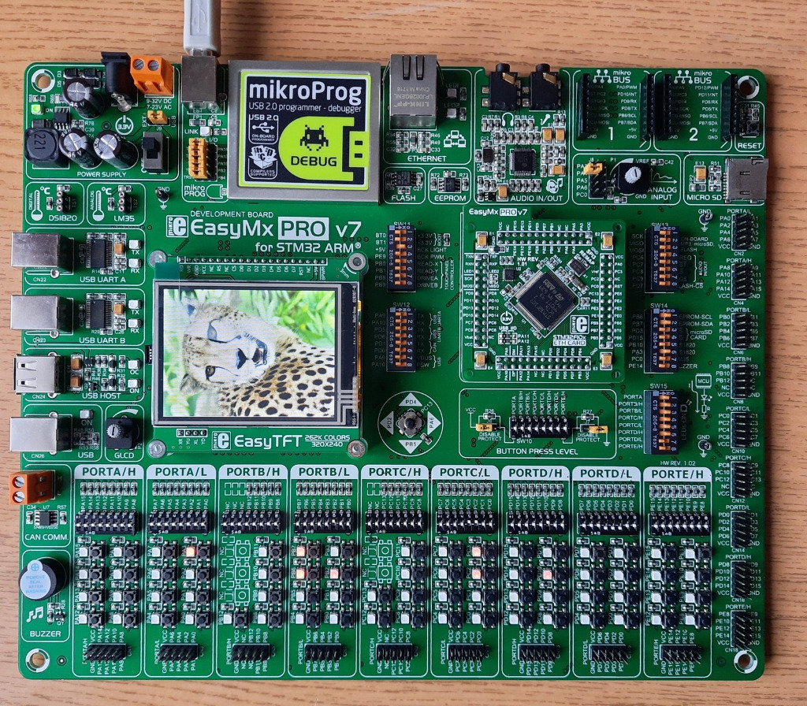

# STM32F407VG_Labs
comprehensive labs undertaken at the Faculty of Engineering, Alexandria University. Each lab includes practical exercises and projects focusing on embedded systems using STM32 microcontrollers. 

# STM32F407VG_Labs

Welcome to the STM32F407VG Labs repository from the Faculty of Engineering, Alexandria University. This repository features a series of comprehensive labs, each comprising practical exercises and projects centered around embedded systems using STM32 microcontrollers.

## Labs Overview

1. **Lab1_GPIO**
   - Adding GPIO Lab exercises.

2. **Lab2_TIM2_PWM**
   - Integrating TIMER2 Lab projects.

3. **STM32F401CD/I2C_Driver_Project**
   - Explore I2C driver projects for the STM32F401CD microcontroller.

## Supplementary Materials

- **Kit.jpg**
  - Visual reference for the hardware kit used in these labs.

- **STM32F407VG_Datasheet.pdf**
  - Supplementary datasheet for the STM32F407VG microcontroller.
